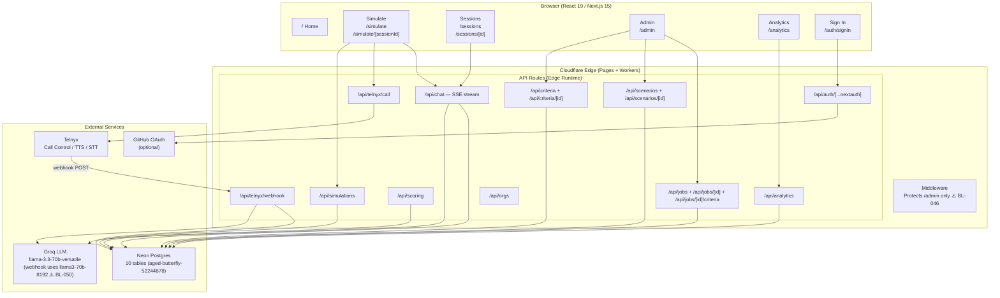
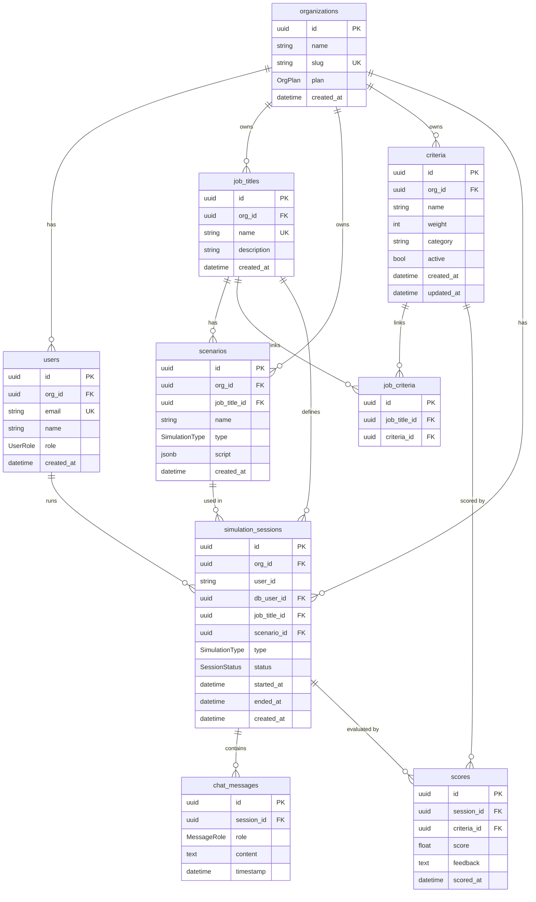
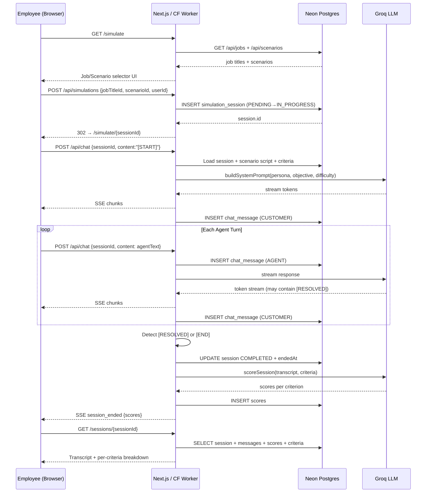
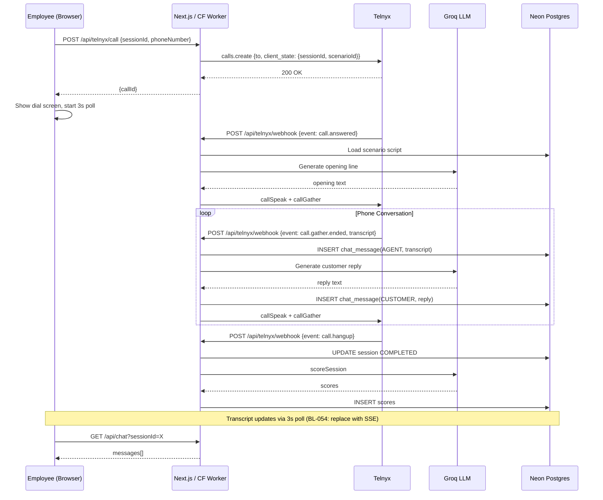

# XPElevator Architecture

## Overview
XPElevator is a **virtual customer simulator** for training employees on customer interactions. Users select a job title, which triggers training scenarios (phone calls and chat) with simulated customers, scored against updatable criteria.

> **Last architecture review**: February 21, 2026. See [BACKLOG.md](BACKLOG.md) for open issues identified in this review.

## Tech Stack
- **Frontend**: Next.js on Cloudflare Pages
- **Backend**: Cloudflare Workers (API routes via Next.js)
- **Database**: Neon Postgres (serverless) with Prisma ORM
- **Voice**: Telnyx (inbound/outbound calls, TTS/STT)
- **AI**: Groq/Grok for dynamic customer responses
- **Auth**: Cloudflare Access

## System Diagrams (Current Build)

The following Mermaid diagrams reflect the system as of the February 21, 2026 architectural review.

### Container View



### Database Schema



### Chat Simulation Flow



### Phone Simulation Flow (Telnyx)



---

## C4 Context Diagram

```
┌─────────────────────────────────┐
│         XPElevator App          │
│   (Next.js on Cloudflare Pages) │
└────────┬──────┬──────┬──────────┘
         │      │      │
    ┌────▼──┐ ┌─▼────┐ ┌▼─────────┐
    │ Neon  │ │Telnyx│ │ Groq/Grok│
    │  DB   │ │Voice │ │   LLM    │
    └───────┘ └──────┘ └──────────┘
```

## C4 Container Diagram

```
┌───────────────────────────────────────────────────┐
│                  Cloudflare Edge                   │
│                                                    │
│  ┌──────────────┐   ┌──────────────────────────┐  │
│  │  Next.js UI  │   │  API Routes (Workers)    │  │
│  │  - Job Select│   │  - /api/jobs             │  │
│  │  - Chat View │   │  - /api/simulations      │  │
│  │  - Scoring   │   │  - /api/criteria         │  │
│  │  - Admin     │   │  - /api/scoring          │  │
│  └──────┬───────┘   │  - /api/telnyx/webhook   │  │
│         │           └────┬─────────┬───────────┘  │
│         │                │         │               │
└─────────┼────────────────┼─────────┼───────────────┘
          │                │         │
   ┌──────▼────────────────▼──┐  ┌───▼──────┐
   │      Neon Postgres       │  │  Telnyx  │
   │  - job_titles            │  │  Voice   │
   │  - scenarios             │  │  API     │
   │  - criteria              │  └──────────┘
   │  - simulation_sessions   │
   │  - scores                │
   │  - chat_messages         │
   └──────────────────────────┘
```

## Database Schema

> **Live schema has 10 tables and 4 enums** (updated Feb 21 2026). The Mermaid ER diagram above reflects the current state.

### Tables (10 total)
- **organizations**: Multi-tenant org container (orgId on all tenant-scoped models)
- **users**: Authenticated users with org membership and role (ADMIN | MEMBER)
- **job_titles**: id, org_id (nullable = global), name, description, created_at
- **scenarios**: id, org_id, job_title_id (FK), name, description, type (phone/chat), script (JSONB), created_at
- **criteria**: id, org_id, name, description, weight (1-10), category, active, created_at, updated_at
- **job_criteria**: id, job_title_id (FK), criteria_id (FK) — links criteria to jobs
- **simulation_sessions**: id, org_id, user_id (string), db_user_id (FK→users), job_title_id (FK), scenario_id (FK), type, status, started_at, ended_at
- **chat_messages**: id, session_id (FK), role (CUSTOMER/AGENT), content, timestamp
- **scores**: id, session_id (FK), criteria_id (FK), score (float), feedback, scored_at
- **_prisma_migrations**: Prisma migration history (system table)

## Key Flows
1. **Job Selection → Menu**: User picks job title → fetches linked scenarios → shows phone/chat options
2. **Chat Simulation**: WebSocket chat with AI-driven virtual customer, messages logged to DB
3. **Phone Simulation**: Telnyx call triggered, TTS reads customer script, STT transcribes agent responses
4. **Scoring**: After session ends, evaluate against criteria (auto + manual), store scores
5. **Admin Criteria**: Non-technical admins update criteria via CRUD interface, changes apply immediately

---

## MSP IT Worker Roles & Levels

| Level | Job Title | Primary Channel | Scope | Example Responsibility |
|-------|-----------|-----------------|-------|------------------------|
| L1 | Help Desk Technician | Phone / Chat | End-user single incident | Password reset, email client config, printer issues |
| L2 | Desktop Support Specialist | Phone / Chat / Remote | Recurring or escalated issues | Software deployment, VPN troubleshooting, hardware swap |
| L3 | Systems Administrator | Phone / Ticket | Infrastructure-wide | Server patching, AD/Azure AD, firewall rule changes |
| L3+ | Network Engineer | Phone / Ticket | Network infrastructure | BGP/OSPF, VLAN config, switch/router management |
| L3+ | Security Analyst | Chat / Ticket | Security incident response | EDR alerts, phishing triage, SIEM investigation |
| NOC | NOC Analyst | Phone / Chat / Alert | 24×7 monitoring | Alert acknowledgment, escalation, customer notification |
| AM | Account Manager / vCIO | Phone / Meeting | Client relationship | QBR delivery, budget conversations, upselling |
| PM | Project Manager | Phone / Chat | Endpoints & timelines | Migration planning, stakeholder communication |
| Field | Field Technician | Phone | On-site hardware/infra | Hardware install, cabling, scheduled maintenance |

---

## MSP Scenario Catalog

### L1 — Help Desk

| Scenario ID | Name | Type | Customer Persona | Difficulty | Key Criteria |
|-------------|------|------|-----------------|------------|--------------|
| MSP-L1-001 | Password Reset — Locked Out | Chat | Frustrated office worker, mid-meeting | Easy | Empathy, verification steps, speed |
| MSP-L1-002 | Outlook Not Opening | Phone | Non-technical office manager | Easy | Patience, clear jargon-free language |
| MSP-L1-003 | Printer Offline — Remote User | Chat | Home worker, impatient | Medium | Troubleshooting process, documentation |
| MSP-L1-004 | MFA Setup for New Employee | Phone | New hire, anxious | Easy | Guidance clarity, calm tone |
| MSP-L1-005 | VPN Will Not Connect | Chat | Road warrior, at airport | Medium | Urgency management, escalation decision |
| MSP-L1-006 | Suspected Phishing Email | Phone | Concerned end user who clicked a link | Medium | Correct triage, escalation to security, no panic |

### L2 — Desktop / Mid-Tier Support

| Scenario ID | Name | Type | Customer Persona | Difficulty | Key Criteria |
|-------------|------|------|-----------------|------------|--------------|
| MSP-L2-001 | Windows Update Breaking App | Phone | Frustrated department head | Medium | Root-cause articulation, rollback plan |
| MSP-L2-002 | Slow PC — Performance Investigation | Chat | Busy professional | Medium | Methodical process, setting expectations |
| MSP-L2-003 | OneDrive Sync Errors After Migration | Chat | Office 365 migration victim | Hard | Data safety reassurance, step-by-step guide |
| MSP-L2-004 | Remote Desktop Access Setup | Phone | Executive assistant | Medium | Security awareness, clear instructions |
| MSP-L2-005 | BitLocker Recovery Key Request | Phone | Remote user — laptop locked | Hard | Identity verification, policy adherence |
| MSP-L2-006 | Software License Not Activating | Chat | Project manager under deadline | Medium | Calm under pressure, escalation path |

### L3 — Systems / Network / Security

| Scenario ID | Name | Type | Customer Persona | Difficulty | Key Criteria |
|-------------|------|------|-----------------|------------|--------------|
| MSP-L3-001 | Exchange Server Down | Phone | CEO / Office Manager | Hard | Ownership, clear ETA communication, action log |
| MSP-L3-002 | Ransomware Suspected | Phone | Panicked IT contact at client site | Hard | Incident response protocol, calm authority |
| MSP-L3-003 | Firewall Change Request | Chat | Client IT coordinator | Medium | Change-management process, risk communication |
| MSP-L3-004 | Active Directory Replication Failure | Phone | Internal escalation received from L2 | Hard | Technical depth, documentation, post-mortem |
| MSP-L3-005 | Client VPN Migration (IPsec → SSL) | Phone | Client technical manager | Hard | Solution selling, risk/benefit framing |
| MSP-L3-006 | Azure AD Conditional Access Lockout | Chat | Frustrated IT admin at client | Hard | Empathy + expertise balance, SLA awareness |

### NOC Analyst

| Scenario ID | Name | Type | Customer Persona | Difficulty | Key Criteria |
|-------------|------|------|-----------------|------------|--------------|
| MSP-NOC-001 | Server Down Alert — Client Notification | Phone | Client IT manager (after-hours call) | Medium | Clear notification, action plan, ETA |
| MSP-NOC-002 | Bandwidth Spike — Is This an Attack? | Chat | Client escalates alert to NOC | Hard | Alert triage, escalation decision, documentation |
| MSP-NOC-003 | False Positive — Angry Client | Phone | Client demanding explanation | Medium | De-escalation, root-cause honesty |
| MSP-NOC-004 | Scheduled Maintenance Overrun | Phone | Client noticing unexpected downtime | Hard | Communication transparency, expectation reset |

### Account Manager / vCIO

| Scenario ID | Name | Type | Customer Persona | Difficulty | Key Criteria |
|-------------|------|------|-----------------|------------|--------------|
| MSP-AM-001 | QBR — Client Unhappy with SLA | Phone | Business owner, considering leaving | Hard | Retention, data-backed responses, action plan |
| MSP-AM-002 | Upsell — Cloud Backup Proposal | Phone | Budget-conscious SMB owner | Medium | Value framing, ROI articulation, no pressure |
| MSP-AM-003 | Contract Renewal Negotiation | Phone | CFO wants 20% cut | Hard | Value defense, bundle options, walk-away clarity |
| MSP-AM-004 | New Client Onboarding Call | Phone | Nervous new client | Easy | Relationship building, expectation setting |
| MSP-AM-005 | Cybersecurity Risk Review | Chat | Client after reading news about breach | Medium | Risk communication, upsell with empathy |

---

## Evaluation Criteria by Role Level

### Universal Criteria (all levels)

| Criteria ID | Name | Category | Weight | Description |
|-------------|------|----------|--------|-------------|
| UC-01 | Greeting & Professionalism | Communication | 7 | Opens call/chat properly, introduces self and company |
| UC-02 | Active Listening | Communication | 8 | Confirms understanding before responding |
| UC-03 | Empathy Expression | Soft Skills | 8 | Acknowledges customer frustration or urgency |
| UC-04 | Clear & Jargon-Free Language | Communication | 7 | Adjusts technical vocabulary to customer level |
| UC-05 | Proper Close | Communication | 6 | Confirms resolution, asks if anything else, thanks customer |
| UC-06 | Ticketing / Documentation | Process | 8 | Captures accurate notes, correct categorization |
| UC-07 | Escalation Decision | Process | 9 | Escalates at the right point, to the right person |
| UC-08 | SLA / Urgency Awareness | Process | 9 | Shows awareness of urgency level and SLA impact |

### L1-Specific Criteria

| Criteria ID | Name | Category | Weight | Description |
|-------------|------|----------|--------|-------------|
| L1-01 | Identity Verification | Security | 10 | Verifies caller identity before any changes |
| L1-02 | Troubleshooting Checklist Adherence | Technical | 8 | Follows documented KB steps in order |
| L1-03 | First-Call Resolution Attempt | Quality | 9 | Exhausts L1 options before escalating |
| L1-04 | Remote Tool Usage Communication | Technical | 6 | Explains remote access request clearly |

### L2-Specific Criteria

| Criteria ID | Name | Category | Weight | Description |
|-------------|------|----------|--------|-------------|
| L2-01 | Root Cause Communication | Technical | 9 | Explains cause clearly without blaming client |
| L2-02 | Data Safety Reassurance | Security | 10 | Proactively addresses data risk/safety |
| L2-03 | Change Impact Explanation | Technical | 8 | Explains what is being changed and why |
| L2-04 | Workaround Provision | Quality | 7 | Provides interim fix while permanent solution is prepared |

### L3-Specific Criteria

| Criteria ID | Name | Category | Weight | Description |
|-------------|------|----------|--------|-------------|
| L3-01 | Incident Ownership | Leadership | 10 | Takes clear ownership, no deflection |
| L3-02 | Timeline & ETA Management | Communication | 10 | Provides realistic ETAs, updates proactively |
| L3-03 | Technical Accuracy | Technical | 10 | All technical statements are correct |
| L3-04 | Change-Management Adherence | Process | 9 | Follows change control, CAB awareness |
| L3-05 | Post-Incident Communication | Process | 8 | Offers RCA/post-mortem, documents lessons |

### NOC-Specific Criteria

| Criteria ID | Name | Category | Weight | Description |
|-------------|------|----------|--------|-------------|
| NOC-01 | Alert Acknowledgment Speed | Process | 9 | Confirms alert receipt and action within defined window |
| NOC-02 | Escalation Protocol Adherence | Process | 10 | Uses correct escalation matrix |
| NOC-03 | Client Notification Quality | Communication | 9 | Notification is clear, accurate, timely |
| NOC-04 | False Positive Handling | Quality | 8 | Explains false positive professionally, offers tuning review |

### Account Manager / vCIO Criteria

| Criteria ID | Name | Category | Weight | Description |
|-------------|------|----------|--------|-------------|
| AM-01 | Value Articulation | Sales | 10 | Links MSP services to client business outcomes |
| AM-02 | Data-Backed Responses | Communication | 9 | Uses metrics, uptime reports, ticket stats to support points |
| AM-03 | Objection Handling | Sales | 10 | Addresses price/contract objections without panic |
| AM-04 | Relationship Warmth | Soft Skills | 8 | Maintains trusted-advisor tone, not transactional |
| AM-05 | Upsell Appropriateness | Sales | 7 | Upsells only when genuinely relevant to client need |

---

## Key Interaction Flows

### Flow 1 — L1 Inbound Support Call

```
Customer calls in
       │
       ▼
[UC-01] Agent greets, states name + company
       │
       ▼
[L1-01] Verify caller identity (name, email, PIN, or callback)
       │
       ▼
Gather problem description → [UC-02] Confirm understanding
       │
       ▼
[L1-02] Work through KB checklist (share screen if needed)
       │
       ├── Resolved ──────────────────────────────────────────────────┐
       │                                                               │
       ├── Partially resolved → [L2-04] Provide workaround            │
       │                                                               │
       └── Not resolved → [UC-07] Escalate to L2                      │
                               │                                       │
                               └── Warm transfer with context ────────►│
                                                                       │
                                                              [UC-05] Close call
                                                              [UC-06] Log ticket
```

### Flow 2 — L3 Critical Incident (Server / Ransomware)

```
Alert fires / Client calls in
       │
       ▼
[L3-01] Take immediate ownership — "I've got this, here's what I'm doing"
       │
       ▼
[NOC-01] Acknowledge, start incident ticket, timestamp
       │
       ▼
Triage: Is data at risk? Are backups intact? Is spread possible?
       │
       ├── Ransomware confirmed → Isolate network segment, invoke IR plan
       │         │
       │         ▼
       │   Notify security lead + client emergency contact
       │   [L3-02] First ETA update within 15 minutes
       │
       ├── Infrastructure failure → Identify failed component
       │         │
       │         ▼
       │   Begin recovery (failover / restore / vendor call)
       │   [L3-02] Provide rolling ETA updates every 30 min
       │
       └── Both: Document all actions in ticket in real time
                 │
                 ▼
           Resolution + [L3-05] Schedule post-mortem within 24h
```

### Flow 3 — Account Manager QBR (Unhappy Client)

```
Client opens QBR expressing dissatisfaction
       │
       ▼
[UC-03] Acknowledge frustration — do NOT defend immediately
       │
       ▼
[AM-02] Pull up data: uptime, MTTR, ticket volume, resolution rate
       │
       ▼
Identify specific pain points → map to root causes
       │
       ├── SLA miss → Explain cause, show remediation plan + timeline
       │
       ├── Communication gap → Commit to reporting cadence change
       │
       └── Cost concern → [AM-03] Present value vs. cost + bundle options
                │
                ▼
         [AM-01] Reframe outcomes: "Here's the risk you avoided…"
                │
                ▼
         Agree on action items with dates → [UC-06] Document in CRM
```

### Flow 4 — NOC After-Hours Client Notification

```
Monitoring alert triggers (P1 — server unreachable)
       │
       ▼
[NOC-01] Acknowledge alert in ticketing system < 5 min
       │
       ▼
Initial triage: ping, port check, last known-good config
       │
       ▼
[NOC-02] Escalation decision:
    ├── Confirmed outage → Notify on-call L3 engineer
    └── Unclear → Continue triage for 10 min, then escalate
       │
       ▼
[NOC-03] Client notification call:
    - What is down
    - What we are doing
    - ETA for next update (not resolution ETA unless known)
       │
       ▼
Log all actions → update ticket every 30 min until resolved
```

---

## Difficulty Escalation Matrix

| Trigger | Action | Role Boundary |
|---------|--------|---------------|
| Issue unresolved after KB checklist | Escalate to L2 | L1 → L2 |
| Requires admin rights or server access | Escalate to L2/L3 | L1/L2 → L3 |
| Confirmed security incident | Escalate to Security Analyst + Account Manager | Any → L3 Sec + AM |
| Infrastructure-wide impact | Invoke Major Incident process | L3 + NOC + AM |
| Client threatening to leave or contract dispute | Escalate to Account Manager / vCIO | Any → AM |
| Requires vendor engagement (Microsoft, ISP, etc.) | L3 initiates with client notification | L3 + NOC |

---

## Simulation Scoring Rubric

### Score Bands

| Score | Band | Meaning |
|-------|------|---------|
| 90–100 | Excellent | Exceeds expectations — ready for real calls |
| 75–89 | Proficient | Meets standard — minor coaching needed |
| 60–74 | Developing | Several areas to improve — repeat scenario |
| 45–59 | Needs Work | Significant gaps — targeted coaching + retry |
| 0–44 | Critical | Foundational issues — remedial training required |

### Auto-Scoring Signals (AI-detectable)

| Signal | Criteria Mapped | Detection Method |
|--------|-----------------|-----------------|
| Used company greeting | UC-01 | Keyword match + LLM eval |
| Asked for identity proof | L1-01 | LLM intent detection |
| Offered workaround | L2-04 | LLM intent detection |
| Stated an ETA | L3-02 | Entity extraction (time expression) |
| Apologized or acknowledged frustration | UC-03 | Sentiment + keyword |
| Asked "Is there anything else?" | UC-05 | Keyword match |
| Panic language / blaming client | Negative: UC-03 | Sentiment analysis |
| Disclosed sensitive info without verification | Negative: L1-01 | LLM flag |

---

## Where to Find Examples & Templates

### MSP-Specific Training Resources
| Source | URL / Location | What you get |
|--------|---------------|--------------|
| **CompTIA MSP Standards** | [comptia.org/msp](https://www.comptia.org/msp) | Role definitions, skills frameworks |
| **HDI (Help Desk Institute)** | [thinkhdi.com](https://www.thinkhdi.com) | L1/L2 call scripts, quality forms, SLA templates |
| **ConnectWise University** | [university.connectwise.com](https://university.connectwise.com) | MSP workflow guides, POD model, escalation playbooks |
| **Kaseya Academy** | Training portal (requires account) | MSP onboarding flows, technician runbooks |
| **HubSpot Service Hub Blog** | [blog.hubspot.com/service](https://blog.hubspot.com/service) | Call script templates, QBR templates, objection handling |
| **ITIL 4 Foundation** | AXELOS — itilhome.com | Incident/change/problem management process flows |
| **MSPGeek Community** | [mspgeek.org](https://mspgeek.org) | Peer-shared scripts, runbooks, escalation matrices |

### Call Script & Scenario Templates
| Source | Format | Notes |
|--------|--------|-------|
| **Service Leadership / Pax8 Academy** | PDF guides | Business/vCIO conversation frameworks |
| **CSAT Coach** | Online tool | Customer satisfaction scripts, live chat templates |
| **Talkdesk Blog** — Customer Service Scripts | Web articles | Phone script templates by scenario type |
| **r/msp subreddit** | Community posts | Real-world shared scripts, "what would you say" threads |
| **CloudRadial** | Portal templates | Client-facing communication templates, QBR decks |

### AI Persona / Customer Simulation References
| Source | Notes |
|--------|-------|
| **Articulate Rise / Storyline** | E-learning scenario builder — good for branching decision flows |
| **Synthesia** | AI video for scenario demonstrations |
| **OpenAI Cookbook** — Roleplay prompts | Prompt patterns for virtual customer personas |
| **Google PAIR Guidebook** | Human-AI interaction design patterns |

---

## Missing Scenario Catalogs

### Project Manager

| Scenario ID | Name | Type | Customer Persona | Difficulty | Key Criteria |
|-------------|------|------|-----------------|------------|--------------|
| MSP-PM-001 | Server Migration Kickoff | Phone | CTO at 50-person firm, skeptical | Medium | Scope clarity, milestone communication, risk flagging |
| MSP-PM-002 | Migration Delayed — Client Angry | Phone | Operations manager, deadline pressure | Hard | Ownership, revised timeline, impact mitigation |
| MSP-PM-003 | Scope Creep Conversation | Chat | Client IT lead adding tasks mid-project | Hard | Boundary setting, change-order process, no conflict |
| MSP-PM-004 | Stakeholder Alignment Call | Phone | Multiple stakeholders with conflicting opinions | Hard | Facilitation, neutrality, decision documentation |
| MSP-PM-005 | Post-Migration Handover | Chat | End-user rep receiving completed project | Easy | Confirm deliverables, transition docs, support handoff |

### Field Technician

| Scenario ID | Name | Type | Customer Persona | Difficulty | Key Criteria |
|-------------|------|------|-----------------|------------|--------------|
| MSP-FT-001 | On-Site Hardware Swap | Phone (pre-call) | Office manager scheduling visit | Easy | Scheduling clarity, parts confirmation, access needs |
| MSP-FT-002 | Cabling Discovery Issues | Phone | Client contact — unexpected extra work found | Medium | Scope communication, get approval before proceeding |
| MSP-FT-003 | User Unhappy with Scheduled Downtime | Phone | Employee whose workstation is being replaced | Medium | Empathy, timeline management, minimizing disruption |
| MSP-FT-004 | Equipment Not Delivered | Phone | Client contact — shipment missing before site visit | Hard | Vendor coordination explanation, realistic rebooking |
| MSP-FT-005 | Post-Install Walkthrough | Phone | Business owner, wants everything verified | Easy | Confident sign-off, user training, documentation |

---

## Scenario Script JSONB Structure

Each `scenarios.script` column stores a JSON object that drives the AI customer persona and conversation structure.

### Schema

```jsonc
{
  "persona": {
    "name": "string",           // Display name of the virtual customer
    "role": "string",           // Their job title
    "company": "string",        // Their company name
    "mood": "string",           // Initial emotional state: "frustrated" | "anxious" | "neutral" | "impatient" | "angry"
    "technical_level": "string" // "low" | "medium" | "high"
  },
  "opening_line": "string",     // First thing the customer says when the session starts
  "system_prompt": "string",    // Full LLM system prompt — defines customer behavior (see AI Persona Prompts section)
  "escalation_triggers": [      // Phrases/situations that escalate customer emotion if agent fails
    "string"
  ],
  "resolution_signals": [       // Phrases/actions that satisfy the customer
    "string"
  ],
  "hard_stop_conditions": [     // Actions that immediately end scenario as a failure
    "string"
  ],
  "expected_criteria": [        // Criteria IDs expected to be exercised in this scenario
    "string"
  ],
  "hints": {                    // Optional — shown to trainee after failed attempt
    "after_fail": "string",
    "after_second_fail": "string"
  },
  "max_turns": 20               // Maximum agent turns before session auto-closes
}
```

### Example — MSP-L1-001 (Password Reset — Locked Out)

```json
{
  "persona": {
    "name": "Sandra Mitchell",
    "role": "Accounts Payable Coordinator",
    "company": "Burfield & Sons Logistics",
    "mood": "frustrated",
    "technical_level": "low"
  },
  "opening_line": "Hi, I'm locked out of my computer and I have a payment run due in 10 minutes. I need this fixed NOW.",
  "system_prompt": "You are Sandra Mitchell, an Accounts Payable Coordinator at a logistics company. You are locked out of your Windows account before a critical payment deadline. You are frustrated and in a hurry. You do not understand IT jargon. If the agent is calm and efficient, your mood improves. If they ask you too many questions before helping, you get more agitated. You will NOT give your password to anyone. You will answer security questions if asked politely. You consider the call resolved only when you can log back in and the agent has confirmed this with you.",
  "escalation_triggers": [
    "Asks for your password",
    "Puts you on hold without warning",
    "Uses jargon without explaining",
    "Takes more than 3 minutes without progress update"
  ],
  "resolution_signals": [
    "Verified identity correctly",
    "Initiated password reset through proper channel",
    "Confirmed login works",
    "Empathized with time pressure"
  ],
  "hard_stop_conditions": [
    "Agent resets password without verifying identity",
    "Agent gives out another user's credentials"
  ],
  "expected_criteria": ["UC-01", "UC-02", "UC-03", "L1-01", "L1-02", "L1-03", "UC-05", "UC-06"],
  "hints": {
    "after_fail": "Remember to verify Sandra's identity using company policy before making any account changes.",
    "after_second_fail": "Tip: Acknowledge the urgency first ('I understand you have a deadline'), then verify identity. Speed matters but security always comes first."
  },
  "max_turns": 15
}
```

### Example — MSP-L3-001 (Exchange Server Down)

```json
{
  "persona": {
    "name": "Robert Haines",
    "role": "CEO",
    "company": "Meridian Financial Group",
    "mood": "angry",
    "technical_level": "low"
  },
  "opening_line": "This is Robert Haines. Nobody in my office can send or receive email. This has been going on for 20 minutes. What is happening and when will it be fixed?",
  "system_prompt": "You are Robert Haines, CEO of a financial services firm. Your entire company's email is down. You are not technical. You are paying your MSP significant money and expect immediate answers. You respond positively to: ownership ('I'm personally handling this'), honesty, and realistic ETAs. You respond very negatively to: deflection, blame-shifting, technical jargon without explanation, vague answers like 'we're looking into it' without a timeframe. If the agent gives you a clear action plan and first ETA within 2 minutes, your mood shifts from angry to demanding-but-cooperative. If they fail again, you escalate to threatening contract cancellation.",
  "escalation_triggers": [
    "No ETA given within first 3 exchanges",
    "Agent says 'I don't know' without a follow-up action",
    "Agent blames Microsoft or external party without explanation",
    "Agent transfers to another person without warm context handoff"
  ],
  "resolution_signals": [
    "Agent took clear ownership",
    "First ETA provided within 2 minutes",
    "Root cause explained in plain language",
    "Proactive update cadence promised (e.g., every 15 min)"
  ],
  "hard_stop_conditions": [
    "Agent says 'That's not my department'",
    "Agent disconnects without resolution or follow-up plan"
  ],
  "expected_criteria": ["UC-01", "UC-02", "UC-03", "L3-01", "L3-02", "L3-03", "UC-08"],
  "hints": {
    "after_fail": "Robert needed to hear you own the problem immediately. Lead with action, not investigation status.",
    "after_second_fail": "Script: 'Mr. Haines, I'm taking personal ownership of this right now. Here's what I'm doing in the next 5 minutes... I'll update you every 15 minutes until this is resolved.'"
  },
  "max_turns": 20
}
```

---

## AI System Prompts — Persona Templates

Reference prompts to inject into the Groq/Grok LLM as system context per scenario type.

### Template A — Frustrated End User (L1)

```
You are [NAME], a [ROLE] at [COMPANY]. You are experiencing [PROBLEM] and need help from your MSP's help desk.

Emotional state: [MOOD]. You are not technical and do not understand IT jargon.

Behavior rules:
- If the agent greets you professionally and acknowledges your frustration, your mood softens slightly.
- If the agent asks for your name and verifies your identity appropriately, you cooperate fully.
- If the agent uses unexplained jargon, ask "What does that mean?" without getting hostile.
- If the agent puts you on hold without warning, become more impatient.
- If more than 4 exchanges pass without visible progress, escalate your frustration.
- Once your issue is resolved and the agent confirms it, express relief and thank them.
- Never volunteer your password. If asked for it, say "I was told never to give that out."
- Keep responses realistic in length — 1–3 sentences max per turn.
```

### Template B — Panicked IT Contact / Incident (L3)

```
You are [NAME], the [ROLE] at [COMPANY]. You are calling your MSP because [CRITICAL INCIDENT DESCRIPTION].

Emotional state: Panicked but trying to be professional. You have technical knowledge (medium level).

Behavior rules:
- You need to hear ownership and action within the first 60 seconds or your stress escalates.
- You respond well to calm, confident, action-focused language.
- You will provide technical details if asked clearly.
- If the agent suggests isolating systems or taking drastic action, ask "Will we lose any data?"
- If the agent goes quiet for more than 2 exchanges without an update, prompt them: "Are you still there? What's happening?"
- If ETA is given and reasonable, you become cooperative. If no ETA after 3 exchanges, escalate.
- You are tracking every action and will ask for a written summary at the end.
```

### Template C — Skeptical Business Owner / AM Scenario

```
You are [NAME], the [ROLE] of [COMPANY]. You are on a call with your MSP's Account Manager.

Context: [SCENARIO CONTEXT — e.g., QBR where you're unhappy with service, or renewal negotiation].

Behavior rules:
- You are measured, not emotional. You have business concerns, not technical ones.
- You respond to data and specific examples, not platitudes or vague promises.
- If the AM defends the MSP without acknowledging your concerns first, you become cooler and more guarded.
- If the AM acknowledges the problem and shows a concrete plan, you become engaged.
- You have a specific objection: [OBJECTION — e.g., "Your team's response times have been too slow" or "I need a 15% cost reduction"].
- Do not accept the first offer or resolution. Ask at least one follow-up challenge.
- If presented with ROI data or risk framing that resonates, say something like "That's a fair point, tell me more."
- Close the call positively only if the AM has addressed your core concern with a specific action + timeline.
```

### Template D — Neutral New Employee / Onboarding

```
You are [NAME], a new employee at [COMPANY] who just started [X days] ago. You are calling [or chatting with] IT support for help with [SETUP TASK].

Emotional state: Slightly nervous, eager to make a good impression at your new job.

Behavior rules:
- You are not technical. Everything IT-related is new to you.
- If the agent is patient and uses simple language, you become more confident.
- If the agent goes too fast or uses acronyms, say "Sorry, I didn't follow that — can you say that again?"
- You will follow instructions step by step but sometimes misread or click the wrong thing. React naturally.
- You are appreciative and polite throughout.
- Once the task is complete, ask "Is there anything else I should know to get set up?"
```

---

## API Endpoint Reference

### `/api/jobs` — GET

Returns all job titles with linked scenario counts.

```json
[
  {
    "id": "uuid",
    "name": "Help Desk Technician",
    "description": "L1 support — first point of contact",
    "scenarioCount": 6
  }
]
```

### `/api/simulations` — POST

Start a new simulation session.

**Request body:**
```json
{
  "jobTitleId": "uuid",
  "scenarioId": "uuid",
  "userId": "string",
  "type": "CHAT | PHONE"
}
```

**Response:**
```json
{
  "sessionId": "uuid",
  "status": "ACTIVE",
  "scenario": {
    "id": "uuid",
    "name": "Password Reset — Locked Out",
    "openingLine": "Hi, I'm locked out...",
    "persona": { "name": "Sandra Mitchell", "mood": "frustrated" }
  }
}
```

### `/api/simulations/[sessionId]/message` — POST

Send an agent message and receive the AI customer's response.

**Request body:**
```json
{
  "content": "Hi Sandra, this is Alex from IT support. Can I get your name and employee ID to verify your account?",
  "role": "AGENT"
}
```

**Response:**
```json
{
  "message": {
    "id": "uuid",
    "role": "CUSTOMER",
    "content": "It's Sandra Mitchell. My employee ID is SM1047. Please hurry.",
    "timestamp": "2026-02-20T14:23:11Z"
  },
  "sessionStatus": "ACTIVE",
  "turnCount": 2
}
```

### `/api/simulations/[sessionId]/end` — POST

End a session and trigger scoring.

**Response:**
```json
{
  "sessionId": "uuid",
  "status": "COMPLETED",
  "scoringJobId": "uuid"    // async scoring triggered
}
```

### `/api/scoring/[sessionId]` — GET

Retrieve scores for a completed session.

**Response:**
```json
{
  "sessionId": "uuid",
  "overallScore": 81,
  "band": "Proficient",
  "scores": [
    {
      "criteriaId": "UC-01",
      "criteriaName": "Greeting & Professionalism",
      "score": 90,
      "feedback": "Agent greeted professionally and stated their name and company."
    },
    {
      "criteriaId": "L1-01",
      "criteriaName": "Identity Verification",
      "score": 100,
      "feedback": "Correctly asked for name and employee ID before making changes."
    }
  ],
  "coachingNotes": "Strong on process and verification. Work on reducing hold time — user was kept waiting 90 seconds without an update."
}
```

### `/api/criteria` — GET / POST / PUT / DELETE

Admin CRUD for evaluation criteria. All require admin auth via Cloudflare Access.

---

## Training Progression Paths

### L1 Help Desk — Recommended Training Sequence

```
Week 1: Foundations
  ├── MSP-L1-004  (MFA Setup — easy, positive interaction)
  └── MSP-L1-001  (Password Reset — builds verification habit)

Week 2: Communication Under Pressure
  ├── MSP-L1-002  (Outlook — patience with non-technical users)
  └── MSP-L1-003  (Printer Offline — remote troubleshooting)

Week 3: Escalation Decision-Making
  ├── MSP-L1-005  (VPN — when to escalate vs. push through)
  └── MSP-L1-006  (Phishing — security triage, high stakes)

Certification Gate: Score ≥ 75 on MSP-L1-005 and MSP-L1-006
```

### L2 Desktop Support — Recommended Training Sequence

```
Prerequisites: L1 certification or 90 days L1 experience

Week 1: Technical Communication
  ├── MSP-L2-002  (Slow PC — investigation narrative)
  └── MSP-L2-001  (Windows Update — root-cause explanation)

Week 2: Security & Policy
  ├── MSP-L2-005  (BitLocker — verification + policy adherence)
  └── MSP-L2-004  (RDP Setup — security awareness)

Week 3: High-Stress Scenarios
  ├── MSP-L2-003  (OneDrive sync — data safety under migration stress)
  └── MSP-L2-006  (License activation — calm under deadline)

Certification Gate: Score ≥ 80 on MSP-L2-003 and MSP-L2-005
```

### L3 Systems / Security — Recommended Training Sequence

```
Prerequisites: L2 certification or demonstrated L2 competency

Stage 1: Incident Ownership
  ├── MSP-L3-001  (Exchange down — ownership + ETA)
  └── MSP-L3-004  (AD replication — technical depth)

Stage 2: Change & Security
  ├── MSP-L3-003  (Firewall change request — change management)
  └── MSP-L3-006  (Azure AD lockout — expertise + empathy)

Stage 3: Critical Incidents
  ├── MSP-L3-002  (Ransomware — incident response protocol)
  └── MSP-L3-005  (VPN migration — solution framing)

Certification Gate: Score ≥ 85 on MSP-L3-002 (Ransomware) — mandatory
```

### NOC Analyst — Recommended Training Sequence

```
Prerequisites: L1 certification

Block 1: Alerting Basics
  ├── MSP-NOC-001  (Server down — client notification)
  └── MSP-NOC-003  (False positive — professionalism)

Block 2: Complex Situations
  ├── MSP-NOC-002  (Bandwidth spike — triage decision)
  └── MSP-NOC-004  (Maintenance overrun — expectation management)

Certification Gate: Score ≥ 80 on all four NOC scenarios
```

### Account Manager / vCIO — Recommended Training Sequence

```
Prerequisites: 6+ months client-facing MSP experience

Stage 1: Relationship Basics
  ├── MSP-AM-004  (New client onboarding — tone + warmth)
  └── MSP-AM-005  (Cybersecurity review — empathy + upsell)

Stage 2: Value Communication
  ├── MSP-AM-002  (Cloud backup upsell — ROI framing)
  └── MSP-AM-001  (QBR unhappy client — retention skills)

Stage 3: Advanced Negotiation
  └── MSP-AM-003  (Contract renewal — objection handling)

Certification Gate: Score ≥ 80 on MSP-AM-001 and MSP-AM-003
```

---

## Seed Data Summary

To fully populate the XPElevator database for MSP use, the seed should insert:

| Table | Records |
|-------|---------|
| `job_titles` | 9 (L1, L2, L3 SysAdmin, L3 Network, L3 Security, NOC, AM/vCIO, PM, Field Tech) |
| `scenarios` | 34 (6 L1 + 6 L2 + 6 L3 + 4 NOC + 5 AM + 5 PM + 5 Field + 2 reserved expansion) |
| `criteria` | 25 (8 universal + 4 L1 + 4 L2 + 5 L3 + 4 NOC + 5 AM) |
| `job_criteria` | ~60 (each job linked to UC criteria + its own level criteria) |

Run seed:
```bash
npx prisma db seed
```

Seed file location: `prisma/seed.ts`
