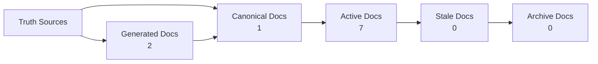

<!-- GENERATED FILE. Do not edit directly. Run npm run docs:diagrams. -->

---
status: generated
owner: platform
doc_type: diagram
fidelity: generated
title: "Factory Documentation Trust Map"
generator: npm run docs:diagrams
last_generated: 2026-05-28
source:
  - docs/_catalog/docs-graph.json
  - docs/_governance/canonical-docs.yml
---

# Factory Documentation Trust Map

This diagram is generated from the docs graph. It intentionally omits the graph hash to avoid self-referential churn because the graph includes generated diagram content hashes.

